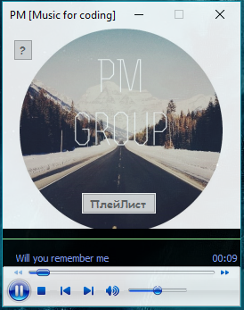

Музыка для кодинга
Программа подгружает музыку с группы http://vk.com/pmpage
Можно изменить группу с которой будет загружаться музыка.

=========================================================================

Как запускать с параметром?
=========================================================================
Макет:<Путь до программы><Айди группы с -><Кол-во постов загружать (Желательно <100. Стандарт - 100)>

Пример: "D:\VK\R1.exe" -74779558 80

Вы можете создать ярлык к программе и в его свойствах, после пути к файлу, дописать id группы кол-во постов.
Если вы указали id, обязательно нужно указывать какое кол-во постов загружать

=========================================================================

По умолчанию используется id "-35193970" и count "100"
Используется метод wall.get.xml. О нем и его ограничения можно почитать в документации vk vpi.

Группы с музыкой для кодинга:

Music for coding (-74779558)  
Perception of music (-35193970)

Update

V5:
+Теперь можно запускать с параметром
+Упаковал dll
+Фиксы

V4:
+Добавил "Плейлист"
+Ускорил загрузку треков
+Поменял дизайн

V3:
+Исправил ошибки

V2:
+Дизайн