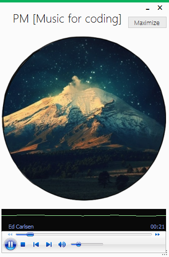
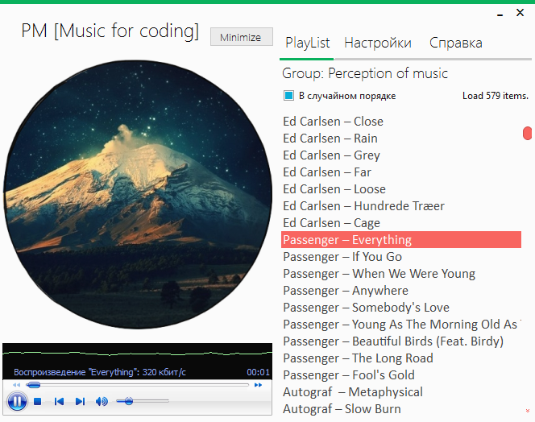
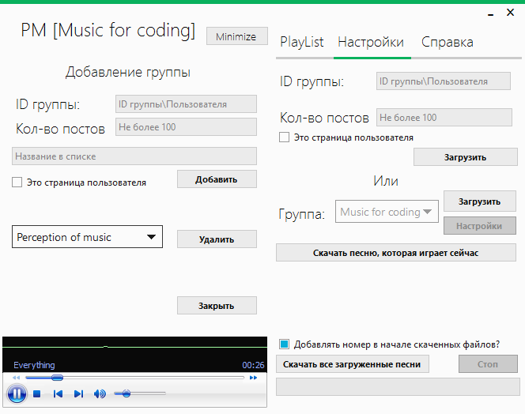

Музыка для кодинга 
Программа подгружает музыку с группы http://vk.com/pmpage  
Можно изменить группу с которой будет загружаться музыка. 

!У Вас должен быть устоновлен windows media player!
 

=========================================================================
Как запускать с параметром?
===
Макет: <Путь до программы><Айди группы с -><Кол-во постов загружать (Желательно <100. Стандарт - 100)>

Пример: "D:\VK\R1.exe" -74779558 80

Вы можете создать ярлык к программе и в его свойствах, после пути к файлу, дописать id группы кол-во постов.  
Если вы указали id, обязательно нужно указывать какое кол-во постов загружать

=========================================================================

 
 

По умолчанию используется id "-35193970" и count "100"  
Используется метод wall.get.xml. О нем и его ограничения можно почитать в документации vk vpi.  

Группы с музыкой для кодинга:  
Music for coding (-74779558)  
Perception of music (-35193970)

Update

V6: 
+ Изменил дизайн 
+ Использовал MetroFramework
+ Фиксы, Комментарии к коду. 
+ Вкладка настройки.  

 
V5: 
+Теперь можно запускать с параметром 
+Упаковал dll 
+Фиксы 

V4: 
+Добавил "Плейлист" 
+Ускорил загрузку треков 
+Поменял дизайн 

V3: 
+Исправил ошибки 

V2: 
+Дизайн 